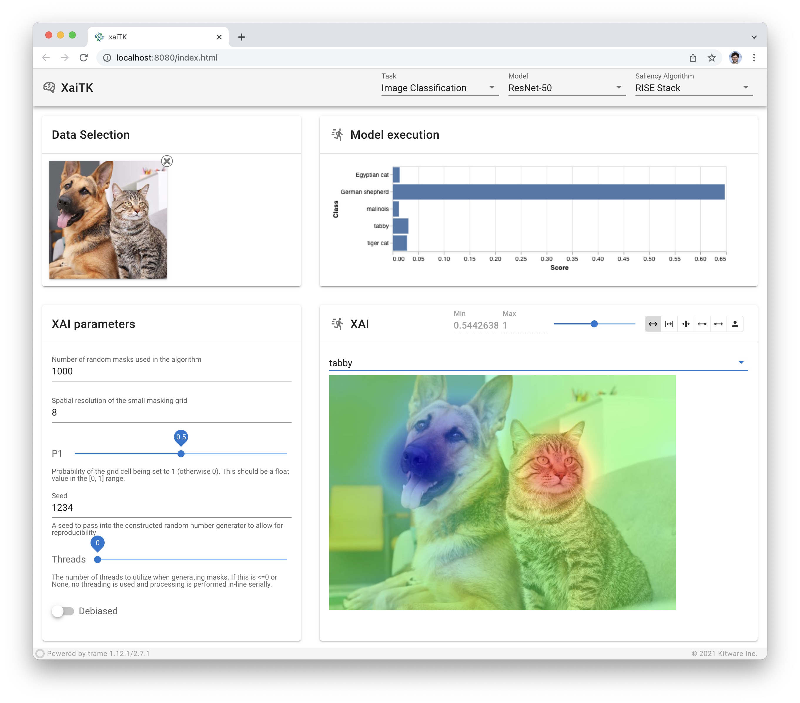
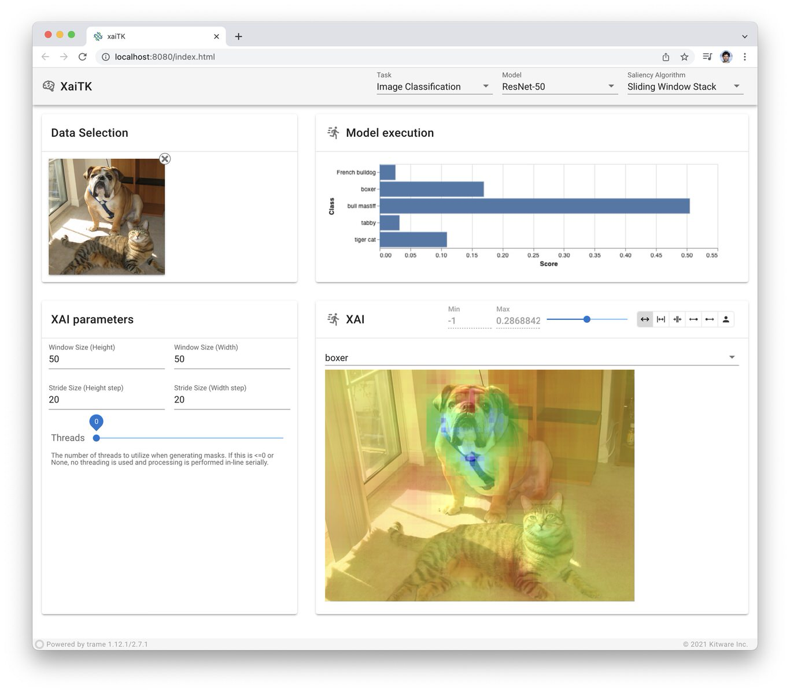
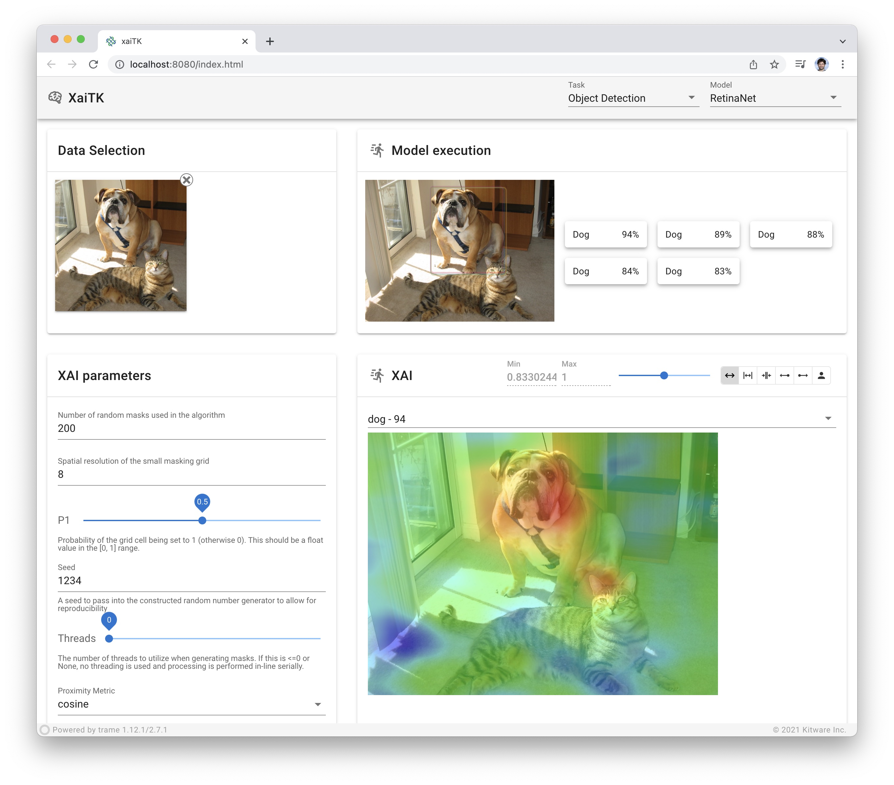
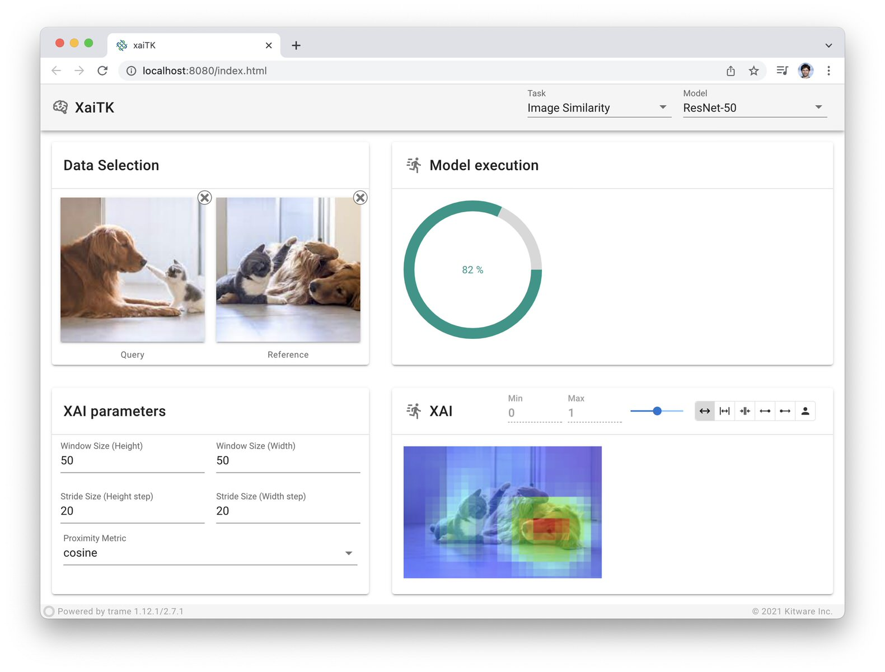

===================
XAITK Saliency Demo
===================

Web application demonstrating XAITK Saliency functionality

* Free software: BSD License
* Created using template from `trame-cookiecutter <https://github.com/Kitware/trame-cookiecutter>`_

Installing
----------

It is recommended to use conda to properly install the various ML packages.

macOS conda setup
^^^^^^^^^^^^^^^^^

.. code-block:: console

    brew install miniforge
    conda init zsh

venv creation for AI
^^^^^^^^^^^^^^^^^^^^

.. code-block:: console

    conda create --name xaitk python=3.9 -y
    conda activate xaitk

    # For development when inside repo
    pip install -e .

    # For testing (no need to clone repo)
    pip install xaitk-saliency-demo

Run the application

.. code-block:: console

    conda activate xaitk
    xaitk-saliency-demo

|image_1| |image_2| |image_3| |image_4|

